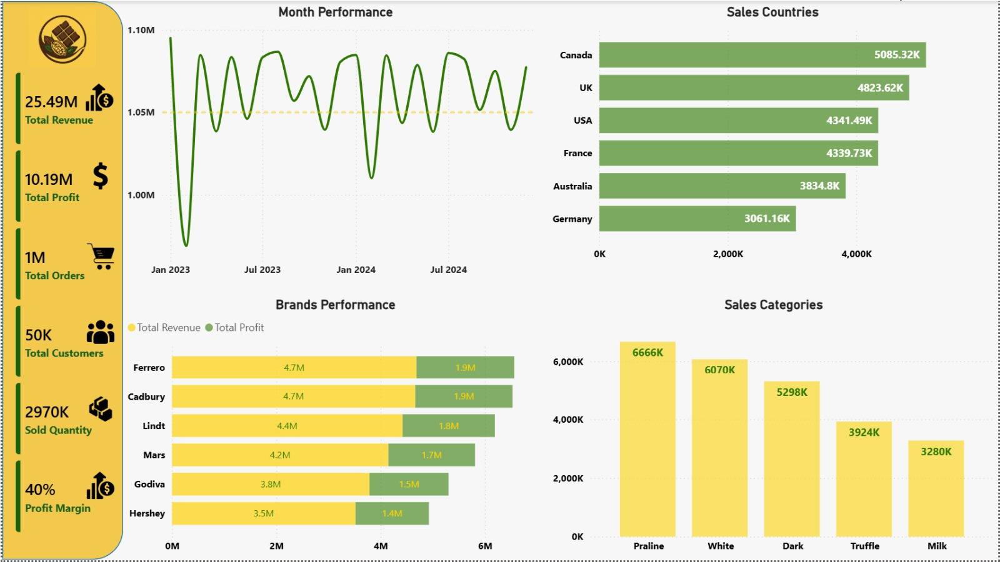
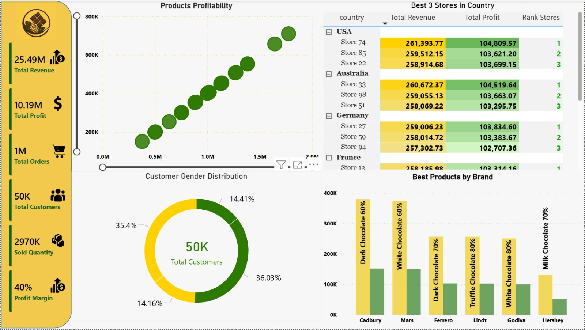

# Chocolate Sales Analysis Dashboard 🍫

## Project Overview
This project analyzes chocolate sales performance using SQL Server and Power BI.

The dashboard provides interactive insights into:
- Revenue trends
- Profitability analysis
- Product performance
- Customer distribution
- Store and country analysis

---

## Tools Used
- SQL Server
- SQL Views
- Window Functions
- Power BI

---

## Insights
1. Canada achieved the highest sales revenue
- Canada generated the strongest overall sales among all countries.
- This indicates a highly profitable market with strong customer demand.

2. Lower profitability is observed during November
- It is noticeable that profit tends to decline during November each year.
- This could be related to seasonal discounts, promotional campaigns, or increased operational costs during that period.

3. Cadbury and Mars dominate brand performance
- Both brands generated the highest revenue and profit.
- They are the core business drivers of the company.

4. Praline products lead category sales
- Praline Chocolate achieved the highest sales quantity among all categories.
- Indicates strong customer preference toward premium sweet flavors.

5. Revenue fluctuates across months
- Monthly revenue shows noticeable fluctuations, with alternating increases and decreases over time.
- This indicates changing customer demand and possible seasonal purchasing behavior.

6. Some stores significantly outperform others
- Top-ranked stores consistently generate higher revenue and profit.
- These stores could be used as benchmarks for operational strategy.

7. Customer distribution is relatively balanced
- Male and female customer contributions are close in percentage.
- Marketing campaigns can effectively target both segments.

8. Ferrero and Cadbury lead overall brand performance
- Ferrero and Cadbury generated the highest revenue and profit among all brands.
- Both brands represent the strongest contributors to the company’s overall business performance.

9. Dark and White chocolate products perform exceptionally well
- Multiple top-selling products belong to Dark and White chocolate categories.
- These product types represent key growth opportunities.

10. The company maintains a strong profit margin
- Overall profit margin reached around 40%.
- Indicates strong financial performance and efficient cost management.

---

## Files Included
- Power BI Dashboard (.pbix)
- SQL Analysis Queries (.sql)
- Dashboard Screenshots
- Icons and Assets

---

## Dashboard Preview

### Intro

### Executive Overview

### Customer & Product Analysis

---

## Created By
Mohamed Hesham
